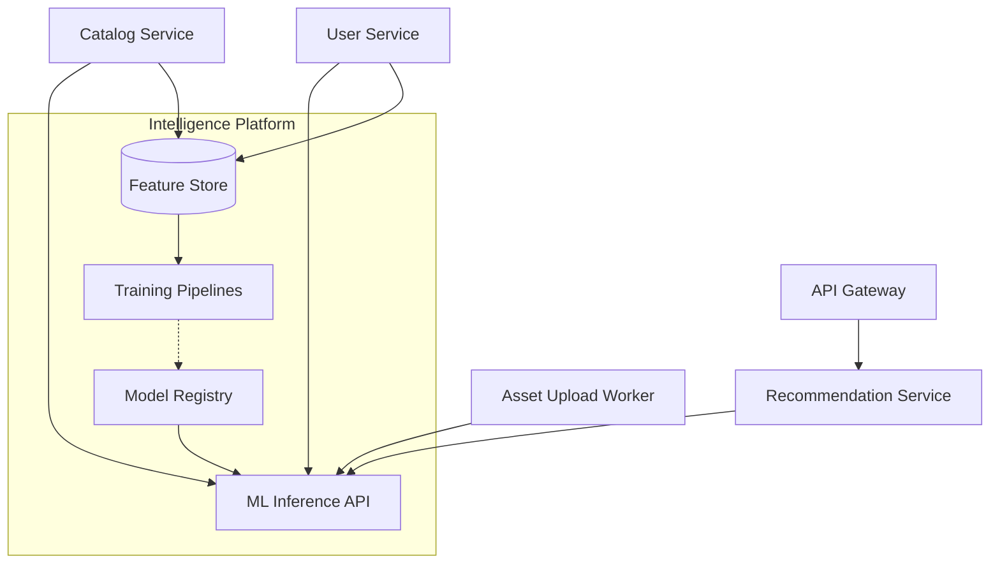

# AI & ML Architecture

## Overview
TemuHash introduces dedicated AI/ML services orchestrated through an "Intelligence Platform" domain. The platform abstracts model lifecycle management, feature stores, and inference pipelines so individual marketplace services can consume intelligent capabilities without tight coupling.

## Core Capabilities
- **Semantic + Visual Search**
  - Text embeddings via multilingual transformer (e.g., OpenSource e5-large). Visual embeddings via CLIP.
  - Vector database (e.g., Weaviate, Pinecone, or OpenSearch kNN) stores representations.
  - API Gateway exposes `/search/semantic` and `/search/visual` endpoints.
  - Asset uploads trigger embedding generation pipelines.

- **Auto-tagging & Classification**
  - Multi-label classification model predicts genre, style, format, engine compatibility.
  - Executed asynchronously post-upload. Results persisted in Catalog Service with confidence scores.
  - Feedback loop allows creators/admins to confirm or reject suggestions for ongoing model improvement.

- **Personalized Recommendations**
  - Hybrid engine: collaborative filtering via implicit matrix factorization + content-based reranking with embeddings.
  - Feature store captures user interactions (views, favorites, purchases) with decay weighting.
  - Recommendation Service provides `/recommendations/{userId}` with fallback to trending assets.

- **Asset Quality Scoring**
  - Ensemble of heuristics (file integrity, metadata completeness) plus ML classifiers to detect anomalies.
  - Integrates virus scanning results, duplicate detection via perceptual hashing, and polycount/format validation.
  - Outputs risk scores used by Moderation workflows and automatic flagging.

- **Asset Finder Assistant**
  - Natural language interface using retrieval-augmented generation (RAG).
  - Query embeddings matched against asset metadata; top candidates fed into LLM response template.
  - Stateless function available via API Gateway and future chat UI.

- **Automatic Code Review**
  - Static analysis pipeline leveraging AST parsing and ML-based malware detection for script/plugin uploads.
  - Integrates with CI/CD triggers when creators push updates via Git providers.

- **AI Upscaling & Optimization**
  - GPU-enabled worker service runs texture upscaling (ESRGAN), mesh decimation, and format conversion.
  - Jobs scheduled via event bus (`asset.optimization.requested`). Results stored in S3 with metadata versioning.

## Implementation Plan
- **Phase 1**: Establish ML infrastructure (feature store, vector DB, model registry) and implement auto-tagging + semantic search.
- **Phase 2**: Launch recommendations, quality scoring, and Asset Finder assistant with RAG pipeline.
- **Phase 3**: Operationalize automated code review and AI upscaling with GPU workers; expand analytics dashboards for model performance.

## Tooling & Operations
- **Model Training**: Prefect/Airflow orchestrating training pipelines with data pulled from warehouse snapshots.
- **CI/CD for Models**: MLflow or Vertex AI Model Registry storing versions, promoting to staging/production with canary evaluation.
- **Monitoring**: Evidently AI for data drift, Prometheus metrics for latency, Grafana dashboards for success ratios.

## Data Governance
- Access controls enforced via Vault-issued credentials and attribute-based policies.
- Pseudonymization of user identifiers in training data; opt-out mechanisms for privacy regulations.
- Audit logs capture model predictions used in moderation or pricing decisions.
