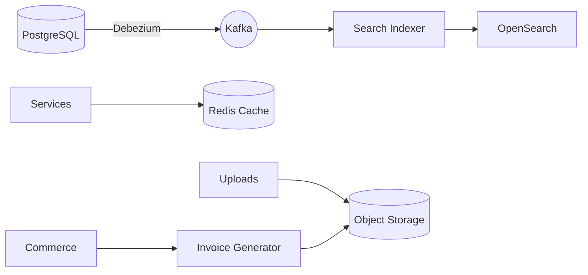

# Data Platform Architecture

## Storage Layers
- **PostgreSQL 16**: Primary relational store for transactional data (users, assets, orders, payouts).
  - Multi-tenant schema support with row-level security for creators vs admins.
  - Logical replication to read replicas for analytics workloads.
- **OpenSearch**: Catalog search, autocomplete, analytics dashboards.
  - Ingest pipeline fed by Kafka events and CDC from PostgreSQL.
  - Index templates tuned for asset metadata (category, tags, polycount, engine compatibility).
- **Redis**: Caching layer for session tokens, rate limiting buckets, trending assets leaderboard.
- **Object Storage (S3)**: Binary asset payloads, preview renders, and CDN distribution.

## Data Flow

## Eventing & Streaming
- **Kafka / Redpanda** topics:
  - `asset.created`, `asset.updated` → trigger indexing and notifications.
  - `order.completed`, `payout.requested` → feed finance analytics.
  - `review.submitted`, `report.flagged` → drive moderation workflows.
- **Schema Registry** (Confluent-compatible) for Avro/Proto schemas.
- **Consumers**: Search indexer, notification service, analytics aggregation jobs.

## Analytics & BI
- **Lakehouse** (future): Iceberg/Delta tables stored in S3 for historical data.
- **Transformation**: dbt + Airflow orchestrating ELT from PostgreSQL snapshots to warehouse.
- **Dashboards**: Grafana for ops metrics, OpenSearch Dashboards for SIEM & usage analytics.

## Governance & Security
- **Data Catalog**: OpenMetadata (future) documenting tables, PII classification.
- **Access Control**: Vault-issued credentials, short-lived tokens for BI users.
- **Backups**: Automated PITR for PostgreSQL, snapshot policies for OpenSearch, versioned S3 buckets.

## Roadmap
- Introduce feature store for recommendation models.
- Add ML inference microservice for semantic search, leveraging vector DB (e.g., Pinecone) while keeping data privacy controls.
- Expand SIEM detections with Sigma rules tied to marketplace events.
